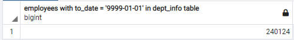
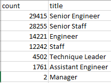
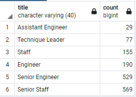
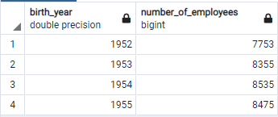
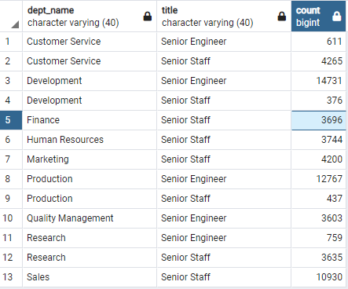

# Pewlett-Hackard-Analysis  
  
## Overview of the analysis  
  
Prior to this analysis, Pewlett Hackard maintained HR records in Excel files.  The company now has a postgres database allowing easy querying of the data to answer questions about the work force.  
  
The company database contains 300,024 employees.  Of the 300,024 240,124 employees are current (have to_date values in the dept_emp table of 9999-01-01).  
  
  
The goals of this analysis are to understand the demographics of the work force and to help plan for a coming wave of employee retirements.  
  
## Results
  
The extracted data files have been exported as .csv files.  
[all titles for potnetially retiring employees](Analysis_Projects_Folder/Pewlett-Hackard-Analysis_Folder/Data/retirement_titles.csv)  
[Current titles for potnetially retiring employees](Analysis_Projects_Folder/Pewlett-Hackard-Analysis_Folder/Data/unique_titles.csv)  
[numbers of possibly retiring employees by title](Analysis_Projects_Folder/Pewlett-Hackard-Analysis_Folder/Data/retiring_titles.csv)  
[possible mentors](Analysis_Projects_Folder/Pewlett-Hackard-Analysis_Folder/Data/mentorship_leigibility.csv)   
  
Several observations can be made from the compiled data.  
- 30,398 employees are expected to retire within the next 3 years,  approximately 13% of the active workforce.  This is an enormous loss of experience and knowledge.  
- The expected retirements are weighted toward senior technical staff- as would be expected.  These positions will likely be filled through promotion from within the organization.  Both promoted employees and the new hires required to back-fill at lower levels will need to be mentored and trained.  One retiring senior level employee could result in 2 or more promotions and one new hire.  Conservatively, 30,398 retiring employees could require 60,796 or more employees to be mentored in new positions.  
  
- 1,549 employees have been identified as eligible to be mentors.  This number is likely inadequate to satisfy the need.  
- The identified list of mentors contain 529 Senior Engineers and 569 Senior Staff.  This is likely inadequate to mentor the expected 84,133 engineer and staff retirements.  
  
  
## Summary  
  
Pewlett Harkard faces a difficult challenge in the coming years.  Answers to two questions are critical to understand the coming retirements and to avoid a crisis.  
  
1. How many retirements will need to be filled in the first year of the silver tsunami?  
  
While the exact timing of retirements is uncertain it is likely that the oldest employees will retire first.  As the table below shows, the first year of the so-called silver tsunami will see 7,753 retirements.  Over the following 3 years there will likely be more than 8,000 retirements per year.  
  
  
  
2. Are there enough qualified, retirement-ready employees in each department to mentor their replacements?  
  
For this analysis qualified, retirement-ready employees are employees born between 1952 and 1955 who have the title of Senior Engineer of Senior Staff.  The table below shows that all departments have at least 3,603 senior employees within the retirement-ready employees.  3,600 or more senior employees should be adequate to train their replacements in the time required.  
    
